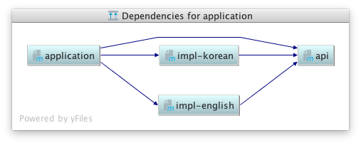

# Java 9 Modules
참고 사이트

- http://www.javamagazine.mozaicreader.com/SeptOct2017#&pageSet=0&page=0&contentItem=0
- https://www.journaldev.com/13106/java-9-modules
- https://www.slideshare.net/rcuprak/preparing-for-java-9-modules-upload
- [A practical guide to Java 9 - compile, jar, run](https://sites.google.com/a/athaydes.com/renato-athaydes/posts/guidetojava9-compilejarrun)

## module 기능이 출시되기까지
- 프로젝트 Jigsaw로도 알려져 있음
- 원래는 2005년 java 7에 포함될 JSR 277: Java Module System로 제안됨
- 나중에 [JSR 376: Java Platform Module System](https://jcp.org/en/jsr/detail?id=376)으로 대체되어 Java 8에 포함될 예정
- 다시 Java 9에 포함시키기로 연기 되었는데, Java9 출시를 두달 앞두고자바 커뮤니티 프로세스 상임 위원회에서 또 다시 부결
- 재투표를 통해 2017년 9월 java 9에 포함되어 드디어 Release
- java 9의 핵심 기능 중 하나

## module 기능이 어떤 도움이 되는가?
소스코드만 봐서는 파악하기 어려운 부분이 있다

### Goal (JSR 376에 의하면)
- Reliable configuration
- Strong encapsulation
- Scalable Java platform
- Greater platform integrity
- Improved performance

> 자바가 출시된 1995년 이래 IoT나 임베디드 시스템과 같이 리소스가 제한적인 
> 장치에서부터 사용되는 소형 어플리케이션에서부터 비지니스의 업무의 
> 핵심을 이루는 대형시스템에 이르기까지 다양하게 이용되지만 
> 플랫폼은 획일적인 단일 크기의 솔루션이었다.
>
>    from Java magazine 

### 개발자에게 가장 체감되는 변화?
접근 제한을 세밀하게 조정할 수 있다


## 살펴보기
백문이 불여일견 일단 만들어보자.

다음에 관한 내용은 생략합니다.
- Maven
- Git
- IntelliJ
- Docker
- Service loader

## 사전준비
- [Java SE Development Kit 9](http://www.oracle.com/technetwork/java/javase/downloads/jdk9-downloads-3848520.html) 설치
- IDE 설치/세팅
- [Docker](https://docs.docker.com/engine/installation/) 설치

### 애플리케이션 구성
- api, impl-english, impl-korean, application, 4개의 프로젝트로 구성된 Maven 멀티 프로젝트 구성
  

- 소개할 내용(3가지)
  - 종래의 방법으로 만들어서 java9에서 실행하기
  - 모듈 기능을 이용하여 만들어서 실행하기
  - jlink로 배포하기

#### api
```java
public interface HelloService {

    String hello();

}
```

#### impl-english
```java
public class Englishimpl implements Helloservice {

    public string hello() {
        return "hello!";
    }

}
```

#### impl-korean
```java
public class KoreanImpl implements HelloService {

    public String hello() {
        return "안녕하세요!";
    }

}
```

#### application
```java
public class Application {

    public static void main(String[] args) {
        ServiceLoader
                .load(HelloService.class)
                .forEach(service -> System.out.println(service.hello()))
                ;

        DateTimeFormatter formatter = DateTimeFormatter.ofPattern("uuuu년 MM월 dd일 HH시 mm분 ss초");
        System.out.println();
        System.out.println("   - ITC인재교류회 제1회 정보공유회, "+ formatter.format(LocalDateTime.now()));
    }

}
```

## 오늘 소개할 내용
### 종래의 방법으로 만들어서 java9에서 실행하기
[normal](normal)

```pom.xml
   ... 생략 ...
    <properties>
        <maven.compiler.source>1.9</maven.compiler.source>
        <maven.compiler.target>1.9</maven.compiler.target>
    </properties>
   ... 생략 ...
    <build>
        <plugins>
            <plugin>
                <groupId>org.apache.maven.plugins</groupId>
                <artifactId>maven-compiler-plugin</artifactId>
                <version>3.7.0</version>
            </plugin>
        </plugins>
    </build>
   ... 생략 ...
```

### 모듈 기능을 이용하여 만들어서 실행하기
[use-modules](use-modules)

- 소스코드 최상위 디렉토리에 module-info.java추가
- module-info.java에 기술할 내용
  - 모듈 이름(유일한 값으로)
  - requires 모듈 이름
  - exports 패키지 이름
  - 등등 
- impl-english, impl-korean 프로젝트의 src/main/resources/META-INF/services 삭제

#### module descriptor syntax


### jlink로 배포하기
[runtime-image](runtime-image)

jlink를 이용하여 JRE가 설치되지 않은 환경에서도 실행 가능한 이미지를 작성할 수 있다 (JRE + 애플리케이션)

#### 애플리케이션 빌드
```bash
mvn clean package
```

#### 애플리케이션 실행(종래의 방법)
```bash
java -cp "runtime-image/target/libs/*" com.hyojinbae.sample.java9.application.Application
```

※ class path에 추가하면 실행은 되지만 모듈로서 동작하지는 않기 떄문에? impl-english, impl-korean이 ServiceLoader로부터 로드되지 않음

#### 애플리케이션 실행(module path에 추가하는 방법)

```bash
java -p "runtime-image/target/libs" --add-modules usemodule.application com.hyojinbae.sample.java9.application.Application
```

```bash
java -p "runtime-image/target/libs/api-1.0-SNAPSHOT.jar:runtime-image/target/libs/application-1.0-SNAPSHOT.jar:runtime-image/target/libs/impl-korean-1.0-SNAPSHOT.jar" --add-modules usemodule.application com.hyojinbae.sample.java9.application.Application
```

※ module path에 추가하지 않은 모듈(impl-english) 는 실행되지 않음.

#### JRE가 설치되지 않은 환경에서 실행해보기
```yml
docker run -it --rm -v $(pwd)/runtime-image/target/libs:/java-sample -w /java-sample centos /bin/bash
```

```bash
pwd
ls -arlt
java -p "runtime-image/target/libs" --add-modules usemodule.application com.hyojinbae.sample.java9.application.Application
exit
```
다음과 같은 메시지가 출력되며 실행되지 않음
> bash: java: command not found

#### 실행 가능한 이미지 작성
```bash
export JAVA_HOME=`/usr/libexec/java_home -v 9`

$JAVA_HOME/bin/jlink -p $JAVA_HOME/jmods:runtime-image/target/libs --add-modules usemodule.application,usemodule.impl.english,usemodule.impl.korean --output dist
```

dist라는 디렉토리에 생성

#### 로컬에서 실행하기
```bash
dist/bin/java com.hyojinbae.sample.java9.application.Application
```

#### JRE가 설치되지 않은 linux 환경에서 실행해보기
```yml
docker run -it --rm -v $(pwd)/dist:/java-sample/dist -w /java-sample centos /bin/bash
```

```bash
dist/bin/java com.hyojinbae.sample.java9.application.Application
```

아래와 같은 메시지가 표시되며 실행되지 않음
> bash: bin/java: cannot execute binary file

#### 실행 가능한 이미지 작성(64비트 Linux)
jlink로 만드는 실행가능한 이미지는 특정 OS에서만 돌아가므로 64비트 Linux에서 실행시키기 위해서는 64비트 Linux용 이미지를 만들 필요가 있음

작업순서 
- 64비트 Linux용 JDK 다운로드
- 압축 풀기
- jlink 명령어의 -p옵션에 $JAVA_HOME/jmods대신에 압축푼 디렉토리 아래의 jdk-9/jmods디렉토리를 지정


```bash
curl -v -j -k -L -H \
         "Cookie: oraclelicense=accept-securebackup-cookie" \
         http://download.oracle.com/otn-pub/java/jdk/9.0.1+11/jdk-9.0.1_linux-x64_bin.tar.gz \
         > jdk-9_linux-x64_bin.tar.gz
```

```bash
cp ./runtime-image/jdk-9_linux-x64_bin.tar.gz .
```

```bash
mkdir jdk9-linux64
tar -zxvf jdk-9_linux-x64_bin.tar.gz -C ./jdk9-linux64
ls -arlt ./jdk9-linux64/jdk-9
```


```bash
rm -rf dist
$JAVA_HOME/bin/jlink -p ./jdk9-linux64/jdk-9/jmods:runtime-image/target/libs --add-modules usemodule.application,usemodule.impl.english,usemodule.impl.korean --output dist
```

#### 로컬에서 실행하기
64비트 linux에서 실행되는 이미지를 만들었기 때문에 더이상 로컬에서는 실행되지 않음

#### JRE가 설치되지 않은 linux 환경에서 실행해보기
JRE가 설치되어 있지 않아도 실행 가능

한글이 깨질 경우 아래 실행후 애플리케이션 실행

```bash
export LANG=ko_KR.UTF-8
localedef -c -f UTF-8 -i ko_KR ko_KR.utf8
```
## 그 외
- non-modular jar VS modular jar
- class path vs module path
- 모듈의 종류
  - explicit module(named module?)
  - automatic module
  - unnamed module
- 모듈간 참조 관계
  - 
  - 
  - 
- [module descriptor syntax 자세히 보기](https://qiita.com/opengl-8080/items/1007c2b2543c2fe0d7d5#requires-%E3%81%AE%E4%BF%AE%E9%A3%BE%E5%AD%90)
